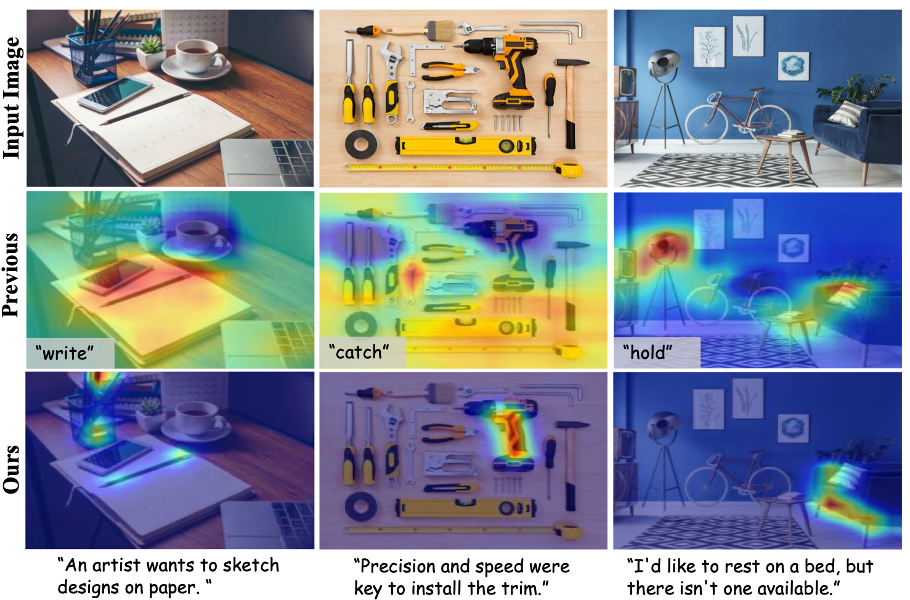
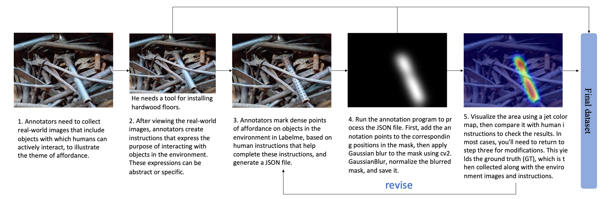

# WorldAfford-Affordance Grounding

This repo contains model, dataset, training codes for our paper: "WorldAfford:Affordance Grounding based on Natural Language Instructions"(ICTAI2024)
## Abstract

Affordance grounding aims to localize the interaction regions for the manipulated objects in the scene image according to given instructions, which is essential for Embodied AI and manipulation tasks. A critical challenge in affordance grounding is that the embodied agent should understand human instructions and analyze which tools in the environment can be used, as well as how to use these tools to accomplish the instructions. Most recent works primarily supports simple action labels as input instructions for localizing affordance regions, failing to capture complex human objectives. Moreover, these approaches typically identify affordance regions of only a single object in object-centric images, ignoring the object context and struggling to localize affordance regions of multiple objects in complex scenes for practical applications. To address this concern, for the first time, we introduce a new task of affordance grounding based on natural language instructions, extending it from previously using simple labels for complex human instructions. For this new task, we propose a new framework, WorldAfford. We design a novel Affordance Reasoning Chain-of-Thought Prompting to reason about affordance knowledge from LLMs more precisely and logically. Subsequently, we use SAM and CLIP to localize the objects related to the affordance knowledge in the image. We identify the affordance regions of the objects through an affordance region localization module. To benchmark this new task and validate our framework, an affordance grounding dataset, LLMaFF, is constructed. We conduct extensive experiments to verify that WorldAfford performs state-of-the-art on both the previous AGD20K and the new LLMaFF dataset.

## 1.Requirements
Install the dependencies listed in `environment.yml` through conda:
- We recommend to firstly install Pytorch with cuda enabled.
- Create a new conda environment:
`conda env create -f environment.yml `
- Or in an existing conda environment:
`conda env update -f environment.yml`

## 2.Datasets
- Download AGD20K dataset from [Google Drive](https://drive.google.com/file/d/1OEz25-u1uqKfeuyCqy7hmiOv7lIWfigk/view?usp=sharing).
- Download LLMaFF dataset from [Google Drive](https://drive.google.com/file/d/1j600M_nWjBRuJX5rGzmLIfdOO6YF-BpJ/view)

## 3.Dataset Collection and Annotation Process
Data Collection Pipeline:

python process_label.py to obtain GT.
## 4.Train
python train.py to train a model.

Please modify the paths.
## 5.Test
python test.py to test a model.

Please modify the paths.

